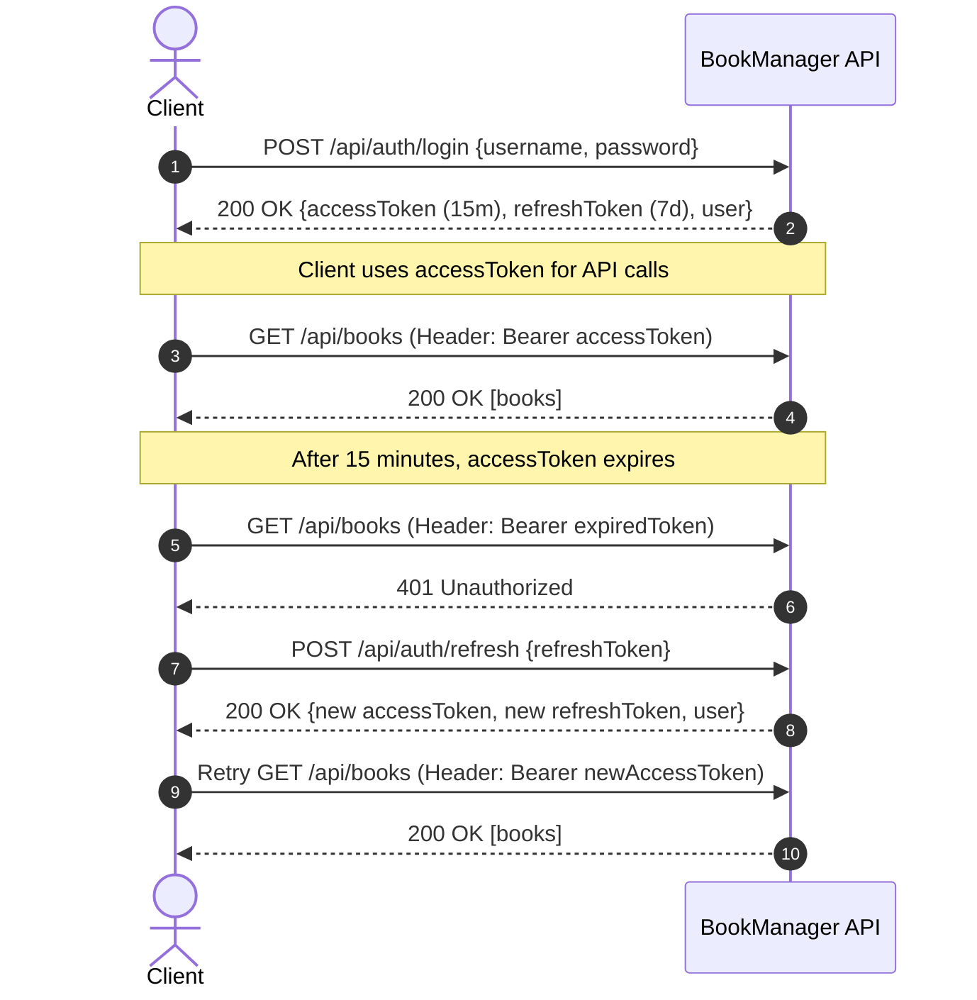

# API Documentation

Comprehensive API reference for the **BookManager** RESTful service, including authentication flows, endpoint specifications, request/response payloads, error structures, and client code samples.

---

## Table of Contents

- [Overview & Base URLs](#overview--base-urls)
- [Authentication](#authentication)
- [Request & Response Standards](#request--response-standards)
- [Error Handling](#error-handling)
- [Authentication Endpoints](#authentication-endpoints)
  - [Register New User](#1-register-new-user)
  - [User Login](#2-user-login)
  - [Refresh Access Token](#3-refresh-access-token)
- [Books Management Endpoints](#books-management-endpoints)
  - [Get All Books (Filter & Sort)](#4-get-all-books)
  - [Get Book By ID](#5-get-book-by-id)
  - [Create Book](#6-create-book)
  - [Update Book](#7-update-book)
  - [Delete Book](#8-delete-book)
  - [Search Books](#9-search-books)
- [API Client Examples](#api-client-examples)
  - [cURL](#curl-examples)
  - [JavaScript (Fetch)](#javascript-fetch-example)
  - [C# (HttpClient)](#c-httpclient-example)
- [Postman Collection](#postman-collection)

---

## Overview & Base URLs

| Environment | Base URL | Description |
| :--- | :--- | :--- |
| **Docker Compose** | `http://localhost:8080` | Default container environment (`API_PORT=8080`). |
| **Local .NET CLI (HTTP)** | `http://localhost:5242` | Direct local execution via `dotnet run`. |
| **Local .NET CLI (HTTPS)** | `https://localhost:7145` | HTTPS local execution profile. |
| **Swagger UI** | `{{BaseURL}}/swagger` | Interactive OpenAPI documentation. |

---

## Authentication

BookManager uses **JWT (JSON Web Token)** for stateless user authentication.

### Authentication Header

All protected endpoints require the access token to be provided in the HTTP `Authorization` header:

```http
Authorization: Bearer <accessToken>
```

### Token Lifetimes & Properties

| Token Type | Lifetime | Secret Key Reference | Primary Purpose |
| :--- | :--- | :--- | :--- |
| **Access Token** | **15 minutes** | `JWT_SECRET` | Authorizes API calls to protected endpoints. |
| **Refresh Token** | **7 days** | `JWT_REFRESH_SECRET` | Obtains a new Access Token upon expiration. |

### Refresh Token Workflow



---

## Request & Response Standards

### Standard Headers

```http
Content-Type: application/json
Accept: application/json
```

### Standard Success Status Codes

- `200 OK`: Request succeeded with data payload.
- `201 Created`: Resource successfully created (includes `Location` response header).
- `204 NoContent`: Resource successfully updated or deleted (empty body).

---

## Error Handling

All errors returned by the system follow the **RFC 7807 Problem Details** specification (`application/problem+json`):

```json
{
  "type": "https://httpstatuses.com/400",
  "title": "Bad Request",
  "status": 400,
  "detail": "Username already exists.",
  "instance": "/api/auth/register"
}
```

### Status Code Reference

| Status Code | Meaning | Typical Trigger |
| :---: | :--- | :--- |
| `200` | OK | Successful GET, Login, or Register. |
| `201` | Created | Successful POST creation. |
| `204` | No Content | Successful PUT update or DELETE. |
| `400` | Bad Request | Validation error or business rule violation (`InvalidOperationException`). |
| `401` | Unauthorized | Missing, invalid, or expired JWT Token. |
| `404` | Not Found | Resource with specified ID does not exist (`KeyNotFoundException`). |
| `500` | Internal Server Error | Unhandled server-side fault. |

---

## Authentication Endpoints

### 1. Register New User

Creates a new user account with BCrypt password hashing.

- **URL**: `/api/auth/register`
- **Method**: `POST`
- **Authentication**: None (`[AllowAnonymous]`)

**Request Body**:
```json
{
  "username": "testuser",
  "password": "Password123@"
}
```

**Response** (`200 OK`):
```json
{
  "id": 1,
  "username": "testuser",
  "role": "User"
}
```

**Error Responses**:
- `400 Bad Request`: `Username already exists.`

---

### 2. User Login

Authenticates user credentials and issues a dual-token pair.

- **URL**: `/api/auth/login`
- **Method**: `POST`
- **Authentication**: None (`[AllowAnonymous]`)

**Request Body**:
```json
{
  "username": "testuser",
  "password": "Password123@"
}
```

**Response** (`200 OK`):
```json
{
  "accessToken": "eyJhbGciOiJIUzI1NiIsInR5cCI6IkpXVCJ9...",
  "refreshToken": "eyJhbGciOiJIUzI1NiIsInR5cCI6IkpXVCJ9...",
  "user": {
    "id": 1,
    "username": "testuser",
    "role": "User"
  }
}
```

**Error Responses**:
- `401 Unauthorized`: `Invalid username or password.`

---

### 3. Refresh Access Token

Exchanges a valid, unexpired Refresh Token for a fresh token pair.

- **URL**: `/api/auth/refresh`
- **Method**: `POST`
- **Authentication**: None (`[AllowAnonymous]`)

**Request Body**:
```json
{
  "refreshToken": "eyJhbGciOiJIUzI1NiIsInR5cCI6IkpXVCJ9..."
}
```

**Response** (`200 OK`):
```json
{
  "accessToken": "eyJhbGciOiJIUzI1NiIsInR5cCI6IkpXVCJ9...",
  "refreshToken": "eyJhbGciOiJIUzI1NiIsInR5cCI6IkpXVCJ9...",
  "user": {
    "id": 1,
    "username": "testuser",
    "role": "User"
  }
}
```

**Error Responses**:
- `401 Unauthorized`: `Invalid or expired refresh token.`

---

## Books Management Endpoints

### 4. Get All Books

Retrieves a list of books with optional full-text search, price filtering, and sorting.

- **URL**: `/api/books`
- **Method**: `GET`
- **Authentication**: None

**Query Parameters**:

| Parameter | Type | Required | Description |
| :--- | :--- | :---: | :--- |
| `search` | `string` | No | Search keyword matching Title, Author, or Category. |
| `sort` | `string` | No | Sort order: `price_asc` (lowest first) or `price_desc` (highest first). Defaults to ID asc. |
| `minPrice` | `decimal` | No | Minimum book price filter (inclusive). |
| `maxPrice` | `decimal` | No | Maximum book price filter (inclusive). |

**Example Request**:
```http
GET /api/books?search=Clean&sort=price_asc&minPrice=100000&maxPrice=500000
```

**Response** (`200 OK`):
```json
[
  {
    "id": 1,
    "title": "Clean Architecture",
    "author": "Robert C. Martin",
    "price": 299000.0,
    "category": "Programming",
    "stock": 50
  },
  {
    "id": 2,
    "title": "Clean Code",
    "author": "Robert C. Martin",
    "price": 320000.0,
    "category": "Programming",
    "stock": 35
  }
]
```

---

### 5. Get Book By ID

Retrieves detailed information for a single book.

- **URL**: `/api/books/{id}`
- **Method**: `GET`
- **Authentication**: None

**Path Parameters**:
- `id` *(integer, required)*: Unique book identifier.

**Response** (`200 OK`):
```json
{
  "id": 1,
  "title": "Clean Architecture",
  "author": "Robert C. Martin",
  "price": 299000.0,
  "category": "Programming",
  "stock": 50
}
```

**Error Responses**:
- `404 Not Found`: `{"message": "Book with ID 999 not found."}`

---

### 6. Create Book

Adds a new book record to the catalog.

- **URL**: `/api/books`
- **Method**: `POST`
- **Authentication**: None

**Request Body**:
```json
{
  "title": "Designing Data-Intensive Applications",
  "author": "Martin Kleppmann",
  "price": 450000.0,
  "category": "Architecture",
  "stock": 25
}
```

**Validation Constraints**:
- `title`: Required, max length 200.
- `author`: Required, max length 100.
- `price`: Range `0` to `1,000,000`.
- `category`: Required, max length 100.
- `stock`: Integer, minimum `0`.

**Response** (`201 Created`):
```json
{
  "id": 3,
  "title": "Designing Data-Intensive Applications",
  "author": "Martin Kleppmann",
  "price": 450000.0,
  "category": "Architecture",
  "stock": 25
}
```
**Headers**:
`Location: /api/books/3`

---

### 7. Update Book

Updates an existing book record.

- **URL**: `/api/books/{id}`
- **Method**: `PUT`
- **Authentication**: None

**Request Body**:
```json
{
  "title": "Designing Data-Intensive Applications (Updated)",
  "author": "Martin Kleppmann",
  "price": 480000.0,
  "category": "Architecture",
  "stock": 20
}
```

**Response** (`204 No Content`): Empty response body.

**Error Responses**:
- `404 Not Found`: `Book with id 999 not found.`

---

### 8. Delete Book

Removes a book from the catalog permanently.

- **URL**: `/api/books/{id}`
- **Method**: `DELETE`
- **Authentication**: None

**Response** (`204 No Content`): Empty response body.

**Error Responses**:
- `404 Not Found`: `Book with id 999 not found.`

---

### 9. Search Books

Quick search endpoint filtering books by keyword.

- **URL**: `/api/books/search`
- **Method**: `GET`
- **Authentication**: None

**Query Parameters**:
- `keyword` *(string, required)*: Term to search across Title, Author, and Category.

**Response** (`200 OK`): Array of matching `BookResponseDto` objects.

---

## API Client Examples

### cURL Examples

#### Login Request:
```bash
curl -X POST http://localhost:8080/api/auth/login \
  -H "Content-Type: application/json" \
  -d '{"username": "testuser", "password": "Password123@"}'
```

#### Fetch Books with Search & Sort:
```bash
curl -X GET "http://localhost:8080/api/books?search=Clean&sort=price_asc" \
  -H "Accept: application/json"
```

#### Create Book:
```bash
curl -X POST http://localhost:8080/api/books \
  -H "Content-Type: application/json" \
  -d '{
    "title": "Domain-Driven Design",
    "author": "Eric Evans",
    "price": 520000,
    "category": "Software Design",
    "stock": 15
  }'
```

---

### JavaScript (Fetch) Example

```javascript
const BASE_URL = 'http://localhost:8080';

// 1. Authenticate
async function login(username, password) {
  const response = await fetch(`${BASE_URL}/api/auth/login`, {
    method: 'POST',
    headers: { 'Content-Type': 'application/json' },
    body: JSON.stringify({ username, password })
  });

  if (!response.ok) {
    const error = await response.json();
    throw new Error(error.detail || 'Login failed');
  }

  const data = await response.json();
  localStorage.setItem('accessToken', data.accessToken);
  localStorage.setItem('refreshToken', data.refreshToken);
  return data;
}

// 2. Fetch Books with Auto-Refresh Handling
async function fetchBooks(query = '') {
  let token = localStorage.getItem('accessToken');

  let response = await fetch(`${BASE_URL}/api/books${query}`, {
    headers: { 'Authorization': `Bearer ${token}` }
  });

  // Handle Token Expiry (401)
  if (response.status === 401) {
    const refreshToken = localStorage.getItem('refreshToken');
    const refreshRes = await fetch(`${BASE_URL}/api/auth/refresh`, {
      method: 'POST',
      headers: { 'Content-Type': 'application/json' },
      body: JSON.stringify({ refreshToken })
    });

    if (refreshRes.ok) {
      const refreshed = await refreshRes.json();
      localStorage.setItem('accessToken', refreshed.accessToken);
      localStorage.setItem('refreshToken', refreshed.refreshToken);

      // Retry original request
      response = await fetch(`${BASE_URL}/api/books${query}`, {
        headers: { 'Authorization': `Bearer ${refreshed.accessToken}` }
      });
    } else {
      localStorage.clear();
      window.location.href = '/login';
      return;
    }
  }

  return await response.json();
}
```

---

### C# (HttpClient) Example

```csharp
using System.Net.Http.Headers;
using System.Net.Http.Json;
using System.Text.Json;

var client = new HttpClient { BaseAddress = new Uri("http://localhost:8080") };

// 1. Login
var loginPayload = new { username = "testuser", password = "Password123@" };
var loginRes = await client.PostAsJsonAsync("/api/auth/login", loginPayload);
loginRes.EnsureSuccessStatusCode();

var authData = await loginRes.Content.ReadFromJsonAsync<JsonElement>();
var accessToken = authData.GetProperty("accessToken").GetString();

// 2. Add Bearer Token Header
client.DefaultRequestHeaders.Authorization = new AuthenticationHeaderValue("Bearer", accessToken);

// 3. Fetch Books
var books = await client.GetFromJsonAsync<List<BookDto>>("/api/books?sort=price_asc");
Console.WriteLine($"Loaded {books?.Count} books.");

record BookDto(int Id, string Title, string Author, decimal Price, string Category, int Stock);
```

---

## Postman Collection

A complete, ready-to-run Postman collection is included in the project root:
📂 [`BookManager.postman_collection.json`](../BookManager.postman_collection.json)

### Key Features:
- Pre-configured requests for all Authentication and Book management endpoints.
- **Automated Token Extraction**: The `Login` and `Refresh Token` requests contain test scripts that automatically save `accessToken` and `refreshToken` into Collection Variables.
- **Inherited Bearer Auth**: All Book requests automatically inherit `{{accessToken}}` without manual copy-pasting.
