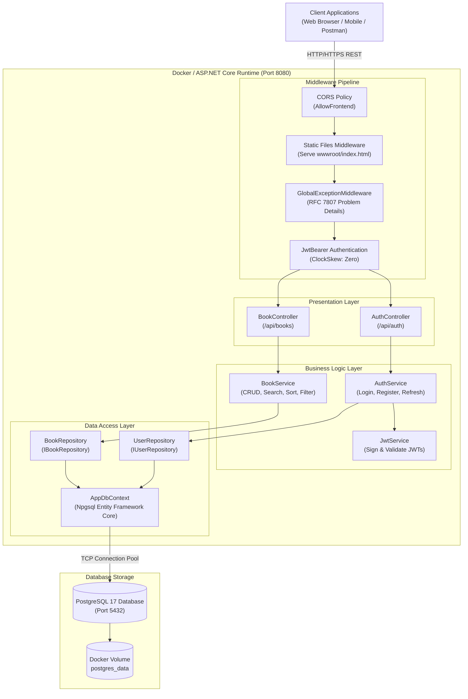
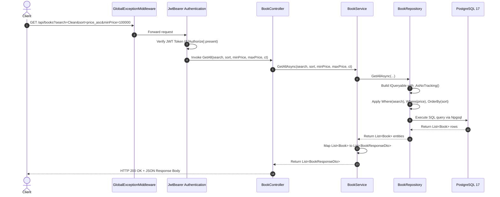
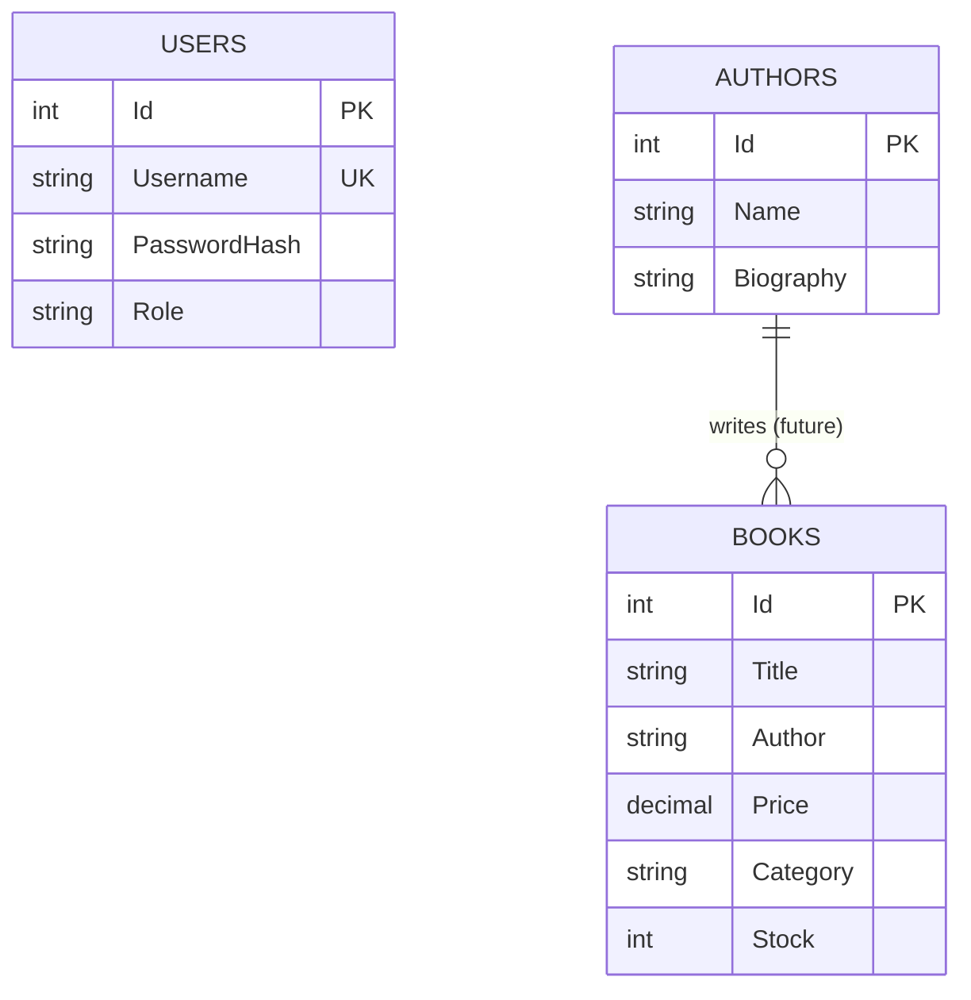

# Architecture Documentation

## Overview

**BookManager** is an enterprise-grade RESTful API built with **ASP.NET Core (.NET 10)** and **PostgreSQL**. The system manages books, authors, and user authentication using modern architectural principles, high-performance query patterns, and a robust dual-token JWT security model.

This document provides a detailed breakdown of the architectural decisions, design patterns, security mechanisms, and scalability strategies employed in the project.

---

## Table of Contents

- [Architecture Principles](#architecture-principles)
- [System Architecture Diagram](#system-architecture-diagram)
- [Layer Responsibilities & Project Structure](#layer-responsibilities--project-structure)
- [Request Lifecycle & Sequence Flow](#request-lifecycle--sequence-flow)
- [Communication Patterns](#communication-patterns)
- [Security Architecture](#security-architecture)
- [Data Management & EF Core](#data-management--ef-core)
- [Scalability & Caching Strategy](#scalability--caching-strategy)
- [Design Patterns Catalog](#design-patterns-catalog)

---

## Architecture Principles

### 1. Clean Layered Architecture
The application is structured into decoupled layers where dependencies point inward toward the core business logic:

```
┌─────────────────────────────────────────────────────────────┐
│                     Presentation Layer                      │
│     (Controllers, GlobalExceptionMiddleware, Extensions)     │
└──────────────────────────────┬──────────────────────────────┘
                               │
┌──────────────────────────────▼──────────────────────────────┐
│                  Business / Service Layer                   │
│        (AuthService, BookService, JwtService, DTOs)         │
└──────────────────────────────┬──────────────────────────────┘
                               │
┌──────────────────────────────▼──────────────────────────────┐
│                        Domain Layer                         │
│                    (Entities: User, Book)                   │
└──────────────────────────────┬──────────────────────────────┘
                               │
┌──────────────────────────────▼──────────────────────────────┐
│                  Data Access / Persistence                  │
│       (UserRepository, BookRepository, AppDbContext)        │
└─────────────────────────────────────────────────────────────┘
```

- **Inward Dependency Rule**: Presentation depends on Services; Services depend on Repositories and Domain; Domain has zero external dependencies.
- **Testability**: Every layer relies on interfaces (`IAuthService`, `IBookService`, `IJwtService`, `IBookRepository`, `IUserRepository`), enabling 100% isolated unit testing via mocking.

### 2. Thin Controller - Fat Service
- **Controllers** are kept strictly "thin" (2-5 lines per action): they only receive HTTP requests, extract parameters, invoke services, and return appropriate HTTP status codes (`200 OK`, `201 Created`, `204 NoContent`).
- **Services** are "fat": they encapsulate all business rules, input sanitization (`.Trim()`), password hashing, token generation, DTO mapping, and exception dispatching.

### 3. Repository Pattern
- All database queries and write operations are encapsulated within repositories.
- Controllers and Services do not directly touch `DbContext` or raw database drivers.
- Repositories apply performance optimizations like `.AsNoTracking()` on read queries and propagate `CancellationToken` throughout.

---

## System Architecture Diagram



---

## Layer Responsibilities & Project Structure

| Component | Path | Responsibility |
| :--- | :--- | :--- |
| **Controllers** | `Controllers/` | HTTP endpoints, routing, parameter extraction, returning `ActionResult<T>`. |
| **Services** | `Service/` | Core business workflows, security logic, DTO mapping, validations. |
| **Repositories** | `Repositories/` | LINQ queries, entity state management, EF Core execution. |
| **DTOs** | `DTOs/` | Data Transfer Objects for Auth and Books, input validation attributes. |
| **Models** | `Models/` | Domain entities mapped to PostgreSQL tables (`User`, `Book`, `Author`). |
| **Data Context** | `Data/` | `AppDbContext`, EF Core configuration, connection string resolution. |
| **Extensions** | `Extensions/` | Service collection registrations (`Database`, `Jwt`, `Services`, `Swagger`). |
| **Middleware** | `Middleware/` | `GlobalExceptionMiddleware` for centralized error translation. |

---

## Request Lifecycle & Sequence Flow

The diagram below illustrates the end-to-end request lifecycle when retrieving books with search and filter parameters:



---

## Communication Patterns

### 1. External Communication (Client → API)
- **Protocol**: HTTP/1.1 and HTTP/2 over TLS (HTTPS).
- **Format**: JSON (`application/json`) with standard UTF-8 encoding.
- **Error Standard**: RFC 7807 Problem Details (`application/problem+json`).

### 2. Internal Database Communication (API → PostgreSQL)
- **Driver**: `Npgsql.EntityFrameworkCore.PostgreSQL`.
- **Connection Pooling**: Npgsql high-performance internal connection pool.
- **Port**: TCP `5432`.
- **Async Execution**: 100% asynchronous with `IAsyncEnumerable` / `ToListAsync(CancellationToken)`.

---

## Security Architecture

```
┌─────────────────────────────────────────────────────────────────────────────┐
│                            JWT Dual-Token Model                             │
├──────────────────────────────────────┬──────────────────────────────────────┤
│             ACCESS TOKEN             │            REFRESH TOKEN             │
├──────────────────────────────────────┼──────────────────────────────────────┤
│ • Lifetime: 15 minutes               │ • Lifetime: 7 days                   │
│ • Secret Key: JWT_SECRET             │ • Secret Key: JWT_REFRESH_SECRET     │
│ • Algorithm: HMAC-SHA256             │ • Algorithm: HMAC-SHA256             │
│ • Claims: id, name, role             │ • Claims: id, name, token_type=refresh│
│ • Usage: Authorization: Bearer <tok> │ • Usage: POST /api/auth/refresh      │
└──────────────────────────────────────┴──────────────────────────────────────┘
```

### 1. Key Isolation
To prevent token-confusion attacks where a client uses a long-lived Refresh Token directly in an `Authorization: Bearer` header, the system enforces **Separate Secret Keys**:
- `JWT_SECRET`: Signs only Access Tokens.
- `JWT_REFRESH_SECRET`: Signs only Refresh Tokens.
- If a client attempts to pass a Refresh Token to a protected API endpoint, the `JwtBearer` middleware rejects it immediately at the cryptographic signature verification step.

### 2. Password Security (BCrypt)
- User passwords are never stored in plaintext.
- Hashing is performed using **BCrypt.Net** with dynamic salting:
  ```csharp
  PasswordHash = BCrypt.Net.BCrypt.HashPassword(dto.Password);
  ```
- Verification uses constant-time comparison to prevent timing attacks:
  ```csharp
  bool isValid = BCrypt.Net.BCrypt.Verify(dto.Password, user.PasswordHash);
  ```

### 3. Strict Token Expiration (`ClockSkew = TimeSpan.Zero`)
By default, ASP.NET Core allows a 5-minute clock drift margin. BookManager explicitly overrides this to `TimeSpan.Zero`, ensuring tokens expire precisely when their expiration timestamp is reached.

---

## Data Management & EF Core

### Entity Relationship Model



### Query Optimization
1. **`AsNoTracking()` on Reads**: All `GetAllAsync` and search queries bypass EF Core's change tracker, reducing memory allocations by ~40% and boosting throughput.
2. **Cancellation Propagation**: Every repository and service method takes `CancellationToken ct = default` to terminate database queries immediately if a client cancels or disconnects.

---

## Scalability & Caching Strategy

### 1. Caching Roadmap
When scaling beyond a single instance:
- **Layer 1 - In-Memory Cache (`IMemoryCache`)**: Cache frequently read, rarely changed lookup tables (e.g., Categories).
- **Layer 2 - Distributed Cache (`Redis`)**:
  - Cache high-traffic query results (`books:page:1:sort:price_asc`) with a 5-minute TTL.
  - Implement Cache-Aside pattern in `BookService`.
  - Store token revocation blacklists.

### 2. Asynchronous Queue Roadmap
- For background jobs such as bulk book imports, report generation, or transactional emails:
  - **In-process**: Use .NET `System.Threading.Channels` for lightweight, non-blocking background workers.
  - **Distributed**: Integrate **RabbitMQ** or **Kafka** via MassTransit for multi-instance event dispatching.

---

## Design Patterns Catalog

| Pattern | Implementation Location | Purpose |
| :--- | :--- | :--- |
| **Repository** | `Repositories/BookRepository.cs`, `UserRepository.cs` | Decouples business logic from EF Core data access. |
| **Dependency Injection** | `Extensions/ServiceExtensions.cs`, `Program.cs` | Inverts control, enables loose coupling and unit testing. |
| **Thin Controller** | `Controllers/AuthController.cs`, `BookController.cs` | Keeps presentation logic minimal and free of business rules. |
| **Middleware Pipeline** | `Middleware/GlobalExceptionMiddleware.cs` | Intercepts all unhandled exceptions and standardizes HTTP responses. |
| **Dual-Token JWT** | `Service/JwtService.cs` | Provides stateless session security with short-lived access tokens. |
| **Design-Time Factory** | `Data/AppDbContextFactory.cs` | Allows EF Core CLI tools (`dotnet-ef`) to run migrations without booting the full web host. |
