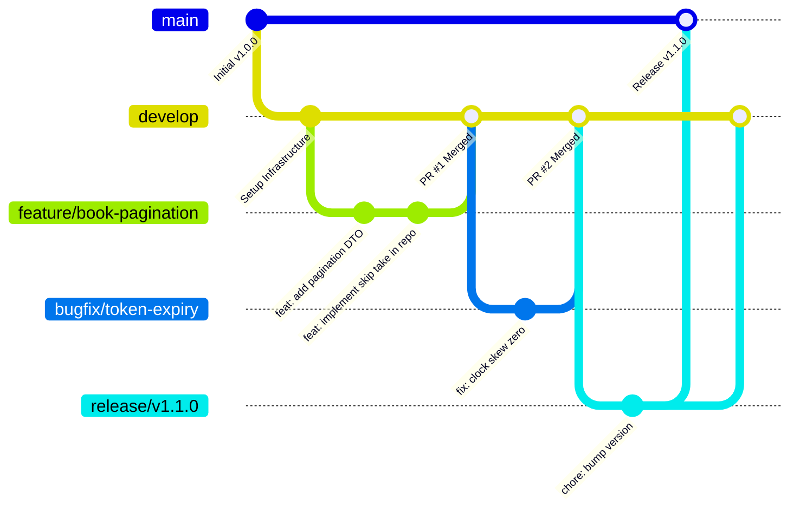

# Contributing Guide

Thank you for your interest in contributing to **BookManager**! This document provides guidelines and workflows to ensure high code quality, consistent development practices, and smooth collaboration across the team.

---

## Table of Contents

- [Code of Conduct](#code-of-conduct)
- [How to Contribute](#how-to-contribute)
- [Git Branching Strategy](#git-branching-strategy)
- [Commit Message Conventions](#commit-message-conventions)
- [Pull Request (PR) Workflow](#pull-request-pr-workflow)
- [PR Acceptance Criteria & Checklist](#pr-acceptance-criteria--checklist)
- [Code Review Guidelines](#code-review-guidelines)
- [Reporting Bugs & Feature Requests](#reporting-bugs--feature-requests)

---

## Code of Conduct

We are committed to providing a welcoming, inclusive, and harassment-free environment for everyone. Contributors are expected to:
- Be respectful and constructive in discussions, code reviews, and issue comments.
- Focus on what is best for the project and community.
- Accept constructive feedback gracefully.

---

## How to Contribute

You can contribute in several ways:
1. **Reporting Bugs**: Submitting detailed bug reports with reproduction steps.
2. **Suggesting Features**: Proposing new capabilities or architectural enhancements.
3. **Submitting Code**: Implementing new endpoints, fixing bugs, or improving documentation.
4. **Code Reviews**: Reviewing pull requests submitted by team members.

---

## Git Branching Strategy

The project follows the **Git Flow** branching model:



### Main Branches
- **`main`**: Production-ready code only. Tagged with semantic versions (`v1.0.0`, `v1.1.0`).
- **`develop`**: Primary integration branch. All feature branches branch from and merge into `develop`.

### Supporting Branch Naming Rules
Branch names must use **lowercase letters** with words separated by hyphens (`-`):

| Branch Type | Format | Example |
| :--- | :--- | :--- |
| **New Features** | `feature/<short-description>` | `feature/book-pagination`, `feature/author-endpoints` |
| **Bug Fixes** | `bugfix/<short-description>` | `bugfix/fix-null-price`, `bugfix/jwt-audience-check` |
| **Hotfixes (Prod)**| `hotfix/<short-description>` | `hotfix/database-connection-timeout` |
| **Refactoring** | `refactor/<short-description>` | `refactor/generic-repository`, `refactor/thin-controller` |
| **Documentation** | `docs/<short-description>` | `docs/update-api-reference`, `docs/setup-guide` |

---

## Commit Message Conventions

We strictly follow the **[Conventional Commits Specification](https://www.conventionalcommits.org/)**:

```text
<type>(<optional scope>): <short description in present tense>

[optional body explaining the motivation and changes]

[optional footer(s) referencing issue IDs, e.g., Closes #123]
```

### Commit Types

| Type | Purpose | Example |
| :--- | :--- | :--- |
| **`feat`** | Adds a new user-facing feature or API endpoint. | `feat(books): add pagination support to GetAllAsync` |
| **`fix`** | Fixes a bug in the application. | `fix(auth): handle expired refresh token gracefully` |
| **`refactor`** | Code change that neither fixes a bug nor adds a feature. | `refactor(jwt): separate secret keys for access and refresh` |
| **`docs`** | Documentation-only changes. | `docs(readme): add docker quick start guide` |
| **`test`** | Adding missing tests or correcting existing tests. | `test(auth): add unit tests for password verification` |
| **`perf`** | Code change that improves performance. | `perf(repo): add AsNoTracking to read-only queries` |
| **`chore`** | Changes to build process, tooling, or dependencies. | `chore(deps): update Npgsql package to latest version` |

### ✅ Good Commit Examples:
- `feat(books): implement sorting by price and title`
- `fix(db): correct environment variable mapping in docker-compose.yaml`
- `docs(api): document RFC 7807 problem details error format`

### ❌ Bad Commit Examples:
- `update code` *(Uninformative)*
- `fixed bug` *(Does not state which module or what was fixed)*
- `WIP` *(Work in progress commits should be squashed before PR)*

---

## Pull Request (PR) Workflow

1. **Synchronize local `develop` branch**:
   ```bash
   git checkout develop
   git pull origin develop
   ```

2. **Create a new feature branch**:
   ```bash
   git checkout -b feature/your-feature-name
   ```

3. **Make changes & verify**:
   - Ensure the solution builds without errors: `dotnet build`.
   - Ensure all tests pass: `dotnet test`.
   - Format code according to standards: `dotnet format`.

4. **Commit and push to remote**:
   ```bash
   git add .
   git commit -m "feat(module): description of your change"
   git push origin feature/your-feature-name
   ```

5. **Open a Pull Request** targeting the `develop` branch on GitHub / GitLab.

---

## PR Acceptance Criteria & Checklist

Before any Pull Request is merged, it must satisfy all criteria below:

- [ ] **Build Status**: Solution builds cleanly with 0 compilation errors or warnings.
- [ ] **Unit Tests**: All existing and new automated tests pass (100% pass rate).
- [ ] **No Merge Conflicts**: Branch is cleanly rebased on top of the latest `develop`.
- [ ] **Clean Architecture Compliant**:
  - Controllers remain thin (no business logic or raw queries).
  - DTOs used for all controller inputs and outputs.
  - Entities and sensitive fields are never exposed directly.
- [ ] **Security Checked**:
  - No plaintext passwords, secret keys, or connection strings committed.
  - Sensitive operations require appropriate `[Authorize]` attributes.
- [ ] **Documentation Updated**: If an API endpoint changed, `docs/API.md` is updated.
- [ ] **Code Review**: At least **1 peer review approval** from a team member.

---

## Code Review Guidelines

When reviewing code submitted by peers:
1. **Focus on Architecture**: Verify separation of concerns and pattern compliance.
2. **Performance**: Check for missing `.AsNoTracking()`, potential N+1 query issues, or unindexed database lookups.
3. **Security**: Validate that input parameters are sanitized and properly constrained.
4. **Constructive Tone**: Provide specific, actionable feedback with code examples where applicable.

---

## Reporting Bugs & Feature Requests

### Reporting a Bug
When filing a bug issue, please include:
1. **Description**: Clear summary of the issue.
2. **Steps to Reproduce**: Detailed steps including endpoint URL, HTTP method, and payload.
3. **Expected Behavior**: What should happen.
4. **Actual Behavior**: What actually happened (include HTTP status code and response body).
5. **Logs / Stacktrace**: Relevant output from `docker compose logs api`.

### Suggesting a Feature
When proposing an enhancement:
1. Explain the business motivation and use case.
2. Provide proposed endpoint designs or entity models.
3. Discuss any architectural implications or migration requirements.
