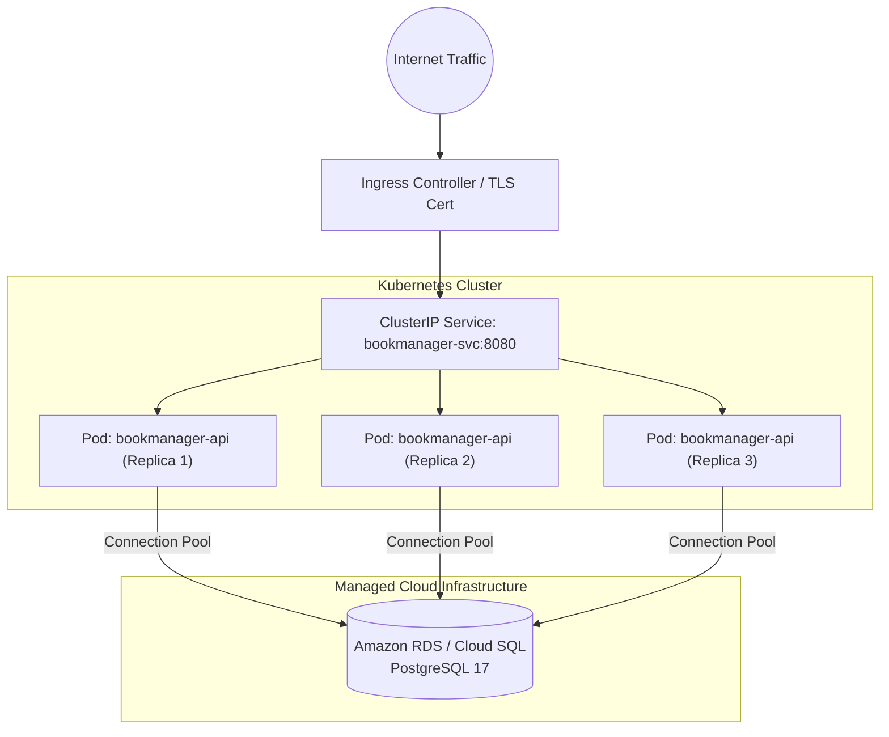

# Deployment Guide

This guide provides operational procedures for deploying, managing, and maintaining the **BookManager** application across Staging and Production environments.

---

## Table of Contents

- [Infrastructure & System Requirements](#infrastructure--system-requirements)
- [Environment Configuration Reference](#environment-configuration-reference)
- [Docker & Docker Compose Deployment](#docker--docker-compose-deployment)
- [Kubernetes (K8s) Deployment Guide](#kubernetes-k8s-deployment-guide)
- [Database Management & Migrations](#database-management--migrations)
- [Backup & Disaster Recovery Procedures](#backup--disaster-recovery-procedures)
- [Security Hardening for Production](#security-hardening-for-production)
- [Monitoring, Logging & Health Checks](#monitoring-logging--health-checks)
- [Rollback Procedures](#rollback-procedures)

---

## Infrastructure & System Requirements

| Metric | Minimum (Staging / Demo) | Recommended (Production) |
| :--- | :--- | :--- |
| **Operating System** | Ubuntu 22.04 LTS / Debian 12 | Linux (Ubuntu / Alpine / Amazon Linux 2023) |
| **CPU** | 1 vCPU (2.0 GHz) | 2 - 4 vCPUs |
| **RAM** | 2 GB | 4 - 8 GB |
| **Disk Storage** | 20 GB SSD | 50 GB+ NVMe SSD |
| **Container Engine** | Docker Engine 24.0+ & Compose v2 | Docker Engine / Managed Kubernetes (EKS / GKE / AKS) |
| **Database** | PostgreSQL 17 Container | Managed PostgreSQL (AWS RDS / Azure DB / Cloud SQL) |

---

## Environment Configuration Reference

All application runtime settings are managed via environment variables defined in `.env`:

| Variable Name | Required | Default (Dev) | Description | Production Guidance |
| :--- | :---: | :--- | :--- | :--- |
| `POSTGRES_DB` | Yes | `bookmanager_db` | Name of the PostgreSQL database. | Use a dedicated database name. |
| `POSTGRES_USER` | Yes | `postgres` | Database admin username. | Avoid default `postgres` username. |
| `POSTGRES_PASSWORD` | Yes | `postgres123` | Database user password. | Must be a strong, random password (16+ chars). |
| `POSTGRES_PORT` | No | `5432` | Host port mapped to Postgres container. | Do not expose port 5432 directly to the public internet. |
| `API_PORT` | No | `8080` | Host port mapped to the API service. | Expose behind an NGINX reverse proxy on 80/443. |
| `ASPNETCORE_ENVIRONMENT` | Yes | `Production` | .NET runtime hosting environment. | Set to `Production` to disable detailed error stack traces. |
| `ASPNETCORE_URLS` | Yes | `http://+:8080` | URLs/ports Kestrel listens on inside container. | Leave as `http://+:8080`. |
| `JWT_SECRET` | Yes | *(Random)* | Secret key for signing Access Tokens. | Must be at least 32 characters (256-bit entropy). |
| `JWT_REFRESH_SECRET` | Yes | *(Random)* | Secret key for signing Refresh Tokens. | Must be distinct from `JWT_SECRET`. |
| `JWT_ISSUER` | Yes | `BookManagerAPI` | Token issuer identifier. | Use your production API domain name. |
| `JWT_AUDIENCE` | Yes | `BookManagerClient` | Token audience identifier. | Use your client application identifier. |
| `JWT_EXPIRES_MINUTES` | No | `15` | Access Token lifetime in minutes. | Recommended: 15 minutes. |
| `JWT_REFRESH_EXPIRES_DAYS`| No | `7` | Refresh Token lifetime in days. | Recommended: 7 - 30 days. |

---

## Docker & Docker Compose Deployment

### 1. Multi-Stage Dockerfile Overview
The application uses an optimized, secure multi-stage `Dockerfile`:
- **Build Stage**: Uses `mcr.microsoft.com/dotnet/sdk:10.0` to restore dependencies and publish binaries with `-c Release`.
- **Runtime Stage**: Uses lightweight `mcr.microsoft.com/dotnet/aspnet:10.0`, minimizing image size (~220 MB) and eliminating build toolchain vulnerabilities.

### 2. Deployment Steps

```bash
# 1. Clone repository to deployment directory
sudo git clone <repository-url> /opt/bookmanager
cd /opt/bookmanager

# 2. Configure production environment
sudo cp .env.example .env
sudo nano .env

# 3. Build and launch services in detached mode
sudo docker compose up --build -d

# 4. Verify running containers
sudo docker compose ps
```

### 3. Service Management Commands

```bash
# View live logs
sudo docker compose logs -f api

# Restart services with zero data loss
sudo docker compose restart

# Gracefully stop containers (Preserves database volume)
sudo docker compose down

# Update to latest code & rebuild
sudo git pull origin main
sudo docker compose up --build -d
```

---

## Kubernetes (K8s) Deployment Guide

For high-availability, multi-node production setups:



### Sample Kubernetes Manifest (`k8s-deployment.yaml`)

```yaml
apiVersion: apps/v1
kind: Deployment
metadata:
  name: bookmanager-api
  namespace: production
  labels:
    app: bookmanager
spec:
  replicas: 3
  selector:
    matchLabels:
      app: bookmanager
  template:
    metadata:
      labels:
        app: bookmanager
    spec:
      containers:
      - name: api
        image: your-registry.com/bookmanager:v1.0.0
        ports:
        - containerPort: 8080
        envFrom:
        - configMapRef:
            name: bookmanager-config
        - secretRef:
            name: bookmanager-secrets
        resources:
          requests:
            memory: "256Mi"
            cpu: "200m"
          limits:
            memory: "512Mi"
            cpu: "500m"
        readinessProbe:
          httpGet:
            path: /swagger/index.html
            port: 8080
          initialDelaySeconds: 5
          periodSeconds: 10
        livenessProbe:
          httpGet:
            path: /swagger/index.html
            port: 8080
          initialDelaySeconds: 15
          periodSeconds: 20
---
apiVersion: v1
kind: Service
metadata:
  name: bookmanager-svc
  namespace: production
spec:
  type: ClusterIP
  selector:
    app: bookmanager
  ports:
  - port: 80
    targetPort: 8080
```

---

## Database Management & Migrations

### Automated Migrations on Startup
The application automatically executes database migrations during startup via [`DatabaseExtensions.ApplyDatabaseMigrations()`](file:///c:/Users/Admin/Downloads/New%20folder%20%284%29/BookManager/Extensions/DatabaseExtensions.cs#L21-L28). No manual schema application step is required when deploying new versions.

### Verifying Database Connectivity
```bash
# Open interactive PostgreSQL shell inside container
docker exec -it bookmanager-postgres psql -U postgres -d bookmanager_db

# Check tables and migrations history
\dt
SELECT * FROM "__EFMigrationsHistory";
```

---

## Backup & Disaster Recovery Procedures

### 1. Automated Full Backup
Execute `pg_dump` with gzip compression:

```bash
# Create backups directory
mkdir -p /var/backups/postgres

# Run compressed database dump
docker exec -t bookmanager-postgres pg_dump -U postgres -d bookmanager_db | gzip > /var/backups/postgres/bookmanager_$(date +%Y%m%d_%H%M%S).sql.gz
```

### 2. Setting Up Automated Daily Cronjob (02:00 AM)
Add the following line to `crontab -e`:

```cron
0 2 * * * docker exec -t bookmanager-postgres pg_dump -U postgres -d bookmanager_db | gzip > /var/backups/postgres/db_$(date +\%F).sql.gz && find /var/backups/postgres -type f -mtime +30 -delete
```
*(The command also automatically purges backup archives older than 30 days).*

### 3. Database Restore Procedure
To restore the database from a backup file:

```bash
# 1. Stop the API to prevent concurrent writes
docker compose stop api

# 2. Decompress and stream SQL dump into PostgreSQL
gunzip < /var/backups/postgres/bookmanager_20260923_090000.sql.gz | docker exec -i bookmanager-postgres psql -U postgres -d bookmanager_db

# 3. Restart the API
docker compose start api
```

---

## Security Hardening for Production

1. **Reverse Proxy (NGINX / Cloudflare)**:
   - Always terminate SSL/TLS (HTTPS) at the reverse proxy.
   - Do not expose port 8080 or port 5432 directly to public IP addresses.
2. **CORS Restrictions**:
   - Update `Program.cs` CORS policy to only permit your verified production frontend domains.
3. **Secret Key Protection**:
   - Never commit `.env` or production JWT secret keys to Git.
   - Use environment variables or cloud secret stores (AWS Secrets Manager, HashiCorp Vault).

---

## Monitoring, Logging & Health Checks

### Container Health Status
In `docker-compose.yaml`, the PostgreSQL service includes a native healthcheck:
```yaml
healthcheck:
  test: ["CMD-SHELL", "pg_isready -U ${POSTGRES_USER} -d ${POSTGRES_DB}"]
  interval: 5s
  timeout: 5s
  retries: 10
```

### Log Inspection
```bash
# View last 100 log lines with timestamps
docker compose logs --tail=100 -t api

# Follow PostgreSQL error logs
docker compose logs -f postgres
```

---

## Rollback Procedures

If an issue occurs after a deployment:

```bash
# 1. Revert Git repository to the previous stable release tag
git checkout tags/v1.0.0

# 2. Re-build and restart containers
docker compose up --build -d

# 3. If database schema rollback is required:
dotnet ef database update <PreviousMigrationName>
```
